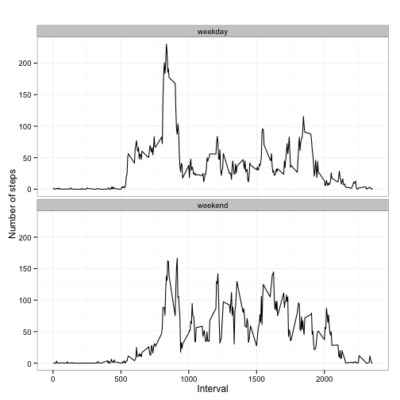

##### Reproducible Research: Peer Assessment 1

Activity monitoring data analysis
=================================

#### Loading and preprocessing the data

First the data is unzipped and loaded. Next required libraries are loaded.

```r
setwd("~/Dropbox/work/zz_coursera/rep_research/ass1/RepData_PeerAssessment1")
unzip("activity.zip")
ads <- read.csv("activity.csv")
library(ggplot2)
```


#### What is mean total number of steps taken per day?

Steps per day are summed up and a histogram is plotted showing the number of steps taken per day.
Also the mean and the median of steps taken per day are calculated.


```r
## Sum up steps per date -> total number of steps per day
table_steps_day <- aggregate(steps ~ date, ads, sum)

## Create histogram of total number of steps per day
hist(table_steps_day$steps, col=1, main="Total number of steps taken per day", xlab="Total number of steps per day")
```

 

```r
## Mean and median of steps per day
mean_default <- mean(table_steps_day$steps)
median_default <- median(table_steps_day$steps)
```

The mean is 1.0766 &times; 10<sup>4</sup> and the median is 10765.

#### What is the average daily activity pattern?

The daily activity pattern is displayed in a line plot.
Furthermore, the interval containing the maximum number of steps is shown.


```r
## Sum up the interval values
table_steps_interval <- aggregate(steps ~ interval, ads, mean)

## Line plot of the 5-minute interval (x-axis) and the average number of 
## steps taken, averaged across all days (y-axis)

plot(table_steps_interval$interval, table_steps_interval$steps, type='l', col = 1,
     main="Average daily activity pattern", xlab="Interval", 
     ylab="Average number of steps")
```

 

```r
## Which 5-minute interval, on average across all the days in the dataset, contains the maximum number of steps
max_five_min_interval <- table_steps_interval$interval[which.max(table_steps_interval$steps)]
```
5-minute interval, on average across all the days in the dataset, containing the maximum number of steps is:  
835


#### Imputing missing values

The missing values are determined and a count is printed.
Next, all missing values are imputed using the interval data previously calculated.
Furthermore, a histogram of the dataset including the imputed values is generated.


```r
## Total number of NAs
na_rows <- ads[is.na(ads$steps), ]

## Print number of NA rows
nrow(na_rows)
```

```
## [1] 2304
```

```r
## Impute missing values 

## Copy dataset
ads_imputed <- ads

for (i in 1:nrow(ads_imputed)){
  if (is.na(ads_imputed$steps[i])){
    ## Get the interval value
    interval_value <- ads_imputed$interval[i] 
    row_index <- which(table_steps_interval$interval == interval_value)
    steps_value <- table_steps_interval$steps[row_index]
    ads_imputed$steps[i] <- steps_value
  }
}

## Imputed data - sum up steps per date -> total number of steps per day
table_steps_day_imputed <- aggregate(steps ~ date, ads_imputed, sum)

## Plot histogram of total number of steps per day (imputed)
hist(table_steps_day_imputed$steps, col=1, main="(Imputed) Histogram of total number of steps per day", xlab="Total number of steps per day")
```

 

Mean and median of the dataset with the imputed values are calculated.


```r
## Mean and median of steps per day
mean_imputed <- mean(table_steps_day_imputed$steps)
median_imputed <- median(table_steps_day_imputed$steps)
```

The mean is 1.0766 &times; 10<sup>4</sup> and the median is 1.0766 &times; 10<sup>4</sup>.

###### Do these values differ from the estimates from the first part of the assignment?  
The default mean is 1.0766 &times; 10<sup>4</sup> and the imputed mean is 1.0766 &times; 10<sup>4</sup>. They do not differ.
The default median is 10765 and the imputed median is 1.0766 &times; 10<sup>4</sup>. They do differ (slightly).

###### What is the impact of imputing missing data on the estimates of the total daily number of steps?

Due to data imputation, the means remain same whereas there is slight change in median value.


#### Are there differences in activity patterns between weekdays and weekends?

A factor variable with weekdays and weekends is created (using the weekdays function).   
Finally, a plot is created using the qqplot2 library showing the number of steps on weekdays and weekends.


```r
## Convert date from string to Date class
ads_imputed$date <- as.Date(ads_imputed$date, "%Y-%m-%d")

## Use weekdays function to create a new column with weekday information
ads_imputed$weekday <- weekdays(ads_imputed$date)

ads_imputed$weekday[which(ads_imputed$weekday %in% c("Saturday","Sunday"))] <- "weekend"
ads_imputed$weekday[which(ads_imputed$weekday != "weekend")] <- "weekday"
ads_imputed$weekday <- factor(ads_imputed$weekday)


# Sum up steps as interval to get average number of steps in an interval across all days
table_steps_interval_imputed <- aggregate(steps ~ interval+weekday, ads_imputed, mean)

# Create plot for weekdays and weekends

qplot(interval, steps, data=table_steps_interval_imputed, geom=c("line"), xlab="Interval", 
      ylab="Number of steps", main="") + facet_wrap(~ weekday, ncol=1) + theme_bw()
```

 


